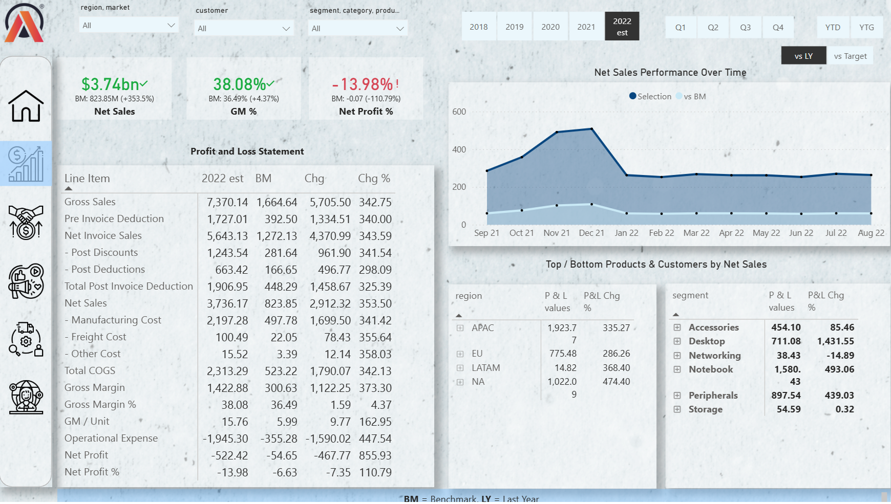
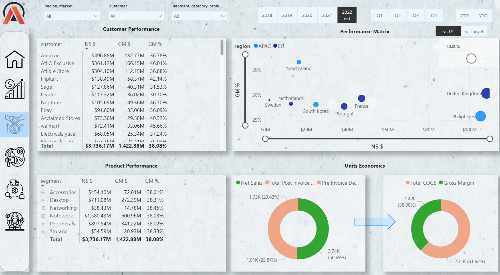
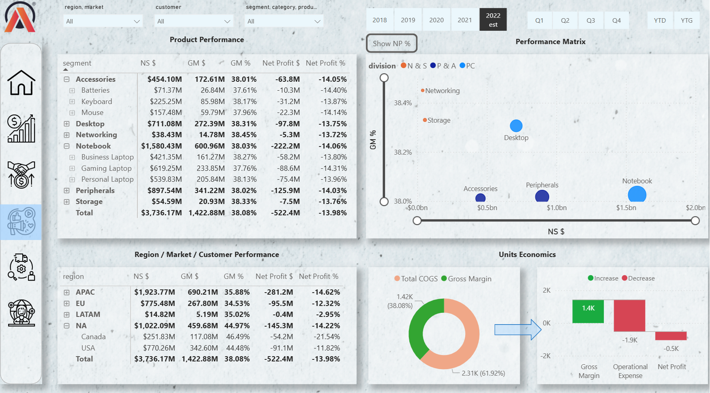
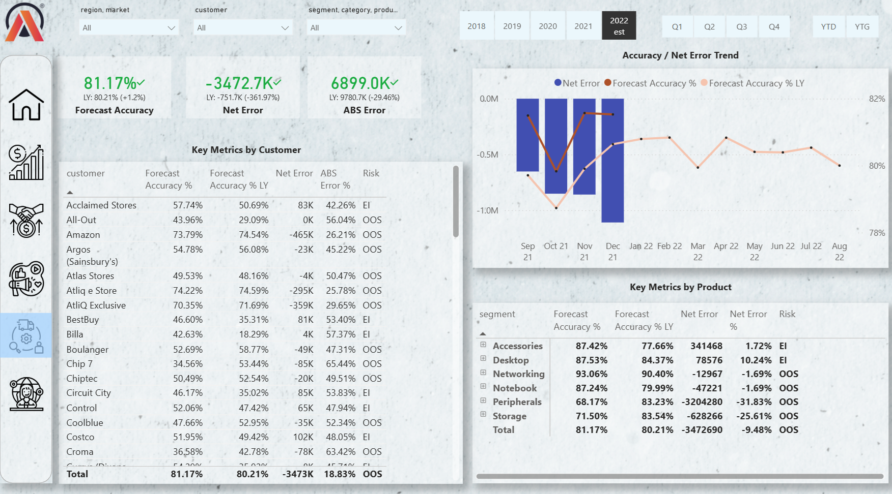
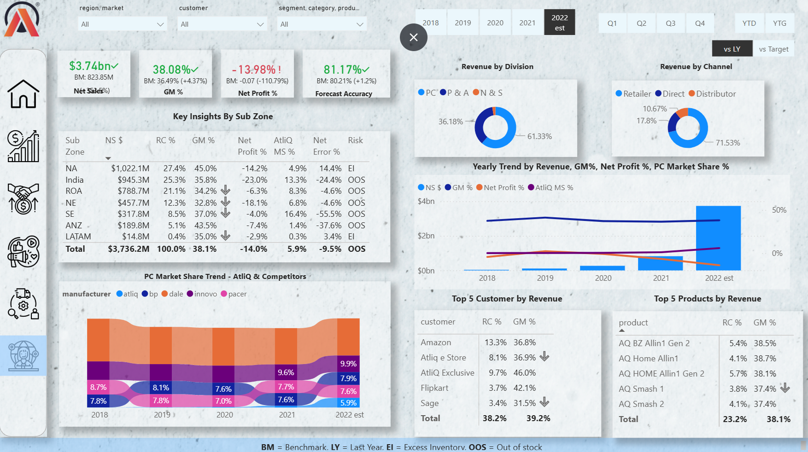

# Business Insights 360 — AtliQ Hardware

A multi-view Power BI report consolidating data from SQL, Excel, and CSV
sources into a unified performance dashboard across Finance, Sales,
Marketing, Supply Chain, and Executive functions.

🔗 **[View Live Dashboard](https://lnkd.in/gKzjRPHH)**

---

## Business Problem

AtliQ Hardware, a growing global hardware manufacturer, faced difficulty
making timely decisions due to fragmented data spread across SQL databases,
Excel files, and CSV datasets. The absence of a unified reporting layer
limited visibility into key metrics and slowed response to market dynamics.

---

## Solution

Designed and delivered an interactive Power BI report that consolidates
multi-source data into a single, stakeholder-specific view — enabling
faster and more precise decisions across all key business functions.

---

## Dashboard Views

| View | Description |
|------|-------------|
| **Finance** | Dynamic Profit & Loss Statement |
| **Sales** | Product and customer performance by Net Sales and Gross Margin |
| **Marketing** | Product-level performance analysis |
| **Supply Chain** | Inventory forecast accuracy and Net Error tracking |
| **Executive** | Consolidated KPI monitoring for strategic decision-making |

---

## Screenshots

### Finance View

### Sales View

### Marketing View

### Supply Chain View

### Executive View

---

## Tools & Techniques

| Category | Tool |
|----------|------|
| Reporting | Power BI Desktop, Power BI Service |
| Data Modeling | Power Query, DAX Studio |
| Data Sources | MySQL Database, MS Excel, CSV files |
| Project Management | Project Charter |

**Key skills applied:**
- Data modeling across multiple source types (SQL, Excel, CSV)
- DAX measures and calculated columns
- Power Query transformations and data cleaning
- Stakeholder-specific report design
- Publishing and managing reports via Power BI Service

---

## Data Sources

Data originates from the AtliQ Hardware business simulation dataset,
comprising:
- **MySQL database** — transactional sales and forecast data
- **Excel/CSV files** — targets, market share, and operational data

Source files are not included in this repository. The live dashboard
reflects the complete dataset.

---

## Credential

Codebasics Power BI Certificate — `CB-49-210737`  
[Codebasics](https://codebasics.io)

---

## Acknowledgements

Project completed under the mentorship of **Dhaval Patel** and
**Hemanand Vadivel** at Codebasics.
